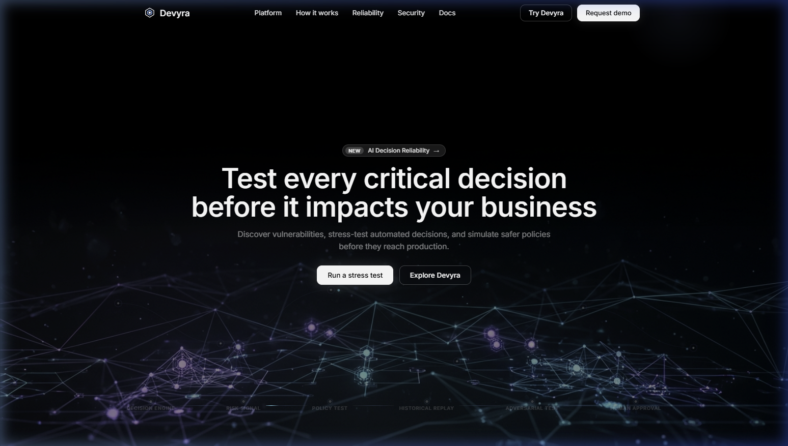
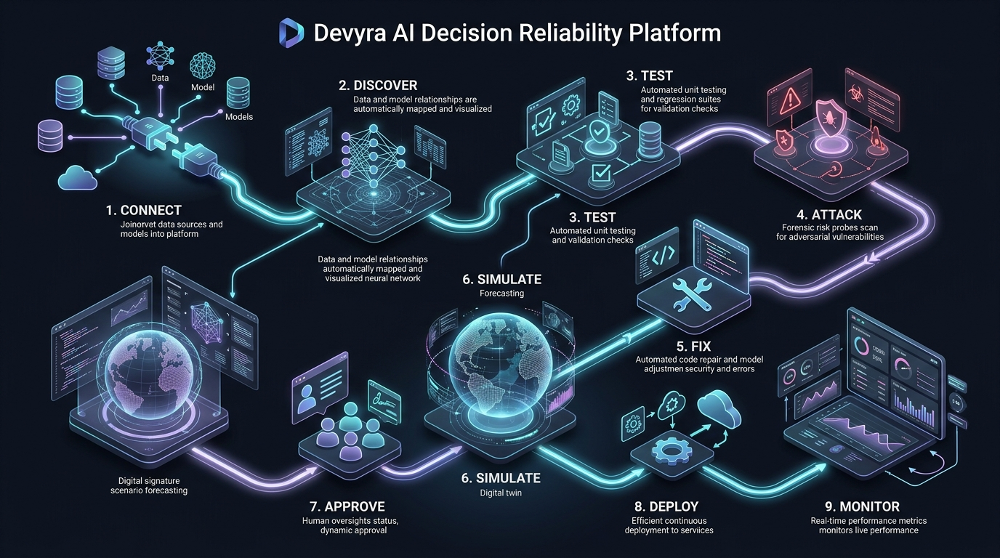
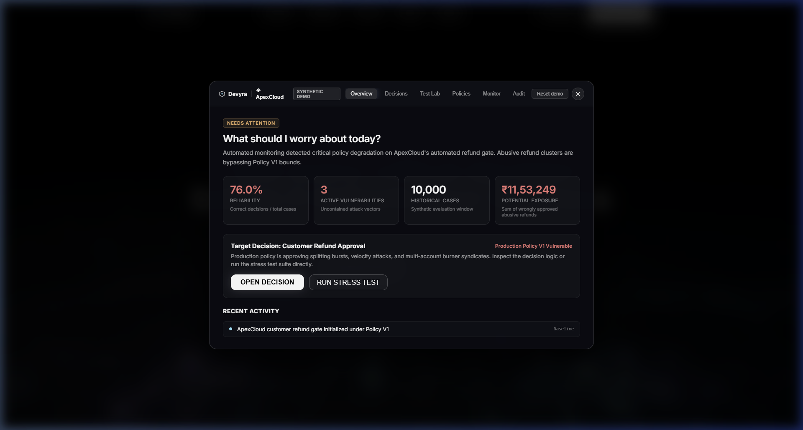
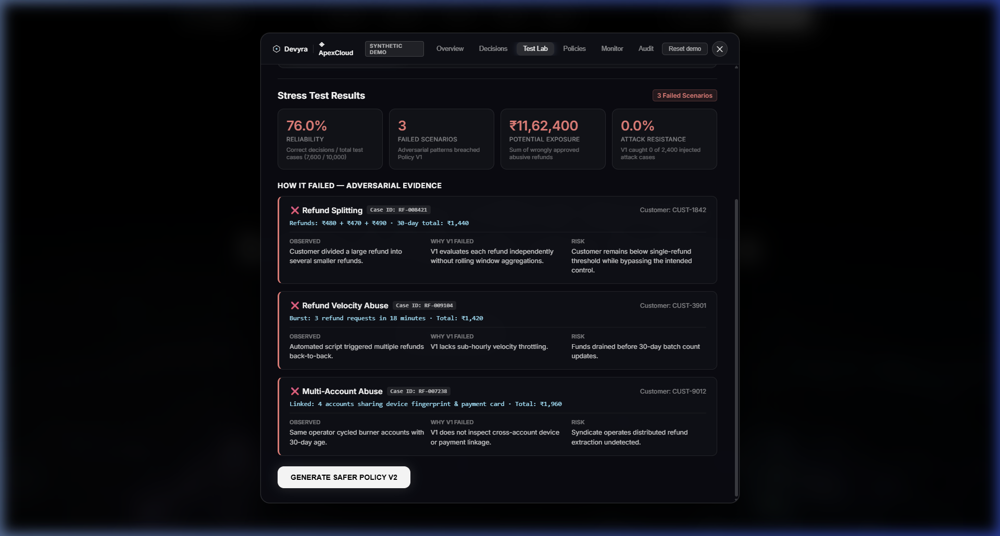
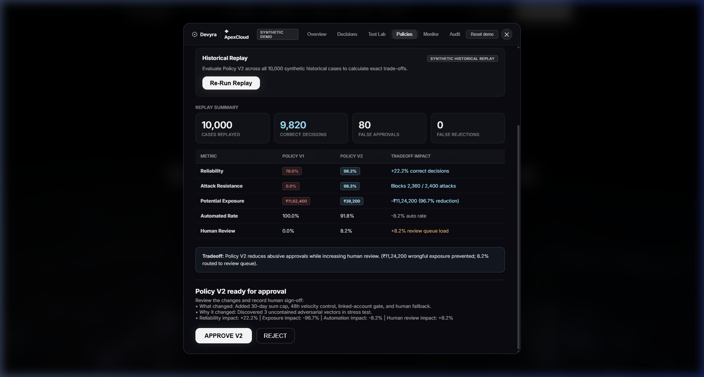
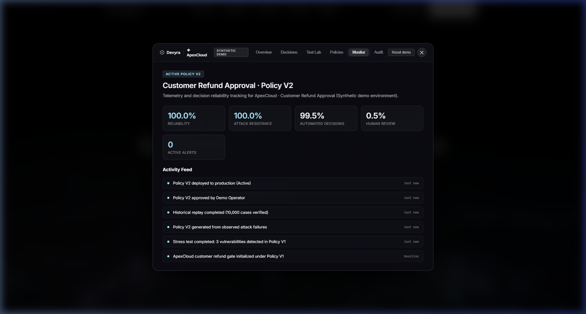
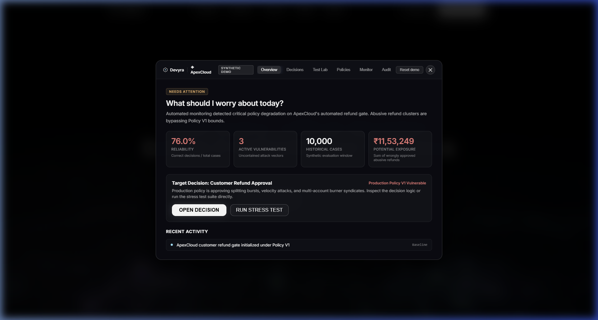

<div align="center">

# ◈ DEVYRA
### **AI Decision Reliability Platform**

> **Test every critical decision before it impacts your business.**

[](https://python.org)
[](https://fastapi.tiangolo.com)
[](https://pytest.org)
[](data/demo/refund_cases_sample.json)
[-purple)](#demo-overview)

<br/>



</div>

---

### 1. Problem: The AI Decision Blindspot

Automated business decisions—such as instant customer refund approvals, dynamic discount grants, autonomous credit gates, and fraud triage—regularly encounter edge cases, adversarial exploits, and silent policy drift. 

In production, rigid or naive automated policies fail silently:
* Single transactions slip under arbitrary threshold limits.
* Syndicated bad actors abuse velocity and burner accounts undetected.
* Businesses face massive cumulative financial exposure without observable audit trails.

---

### 2. Solution: Devyra Decision Reliability

**Devyra** stress-tests critical automated business decisions before they reach customer transactions. By synthesizing realistic edge-case distributions and executing adversarial stress-testing against decision policies, Devyra:
1. **Uncovers hidden failure modes** with forensic case-level evidence.
2. **Derives hardened Policy V2 controls** directly from observed exploit vectors.
3. **Simulates safety vs. operational tradeoffs** across 10,000 historical cases.
4. **Enforces deliberate human approval** prior to production deployment.
5. **Monitors live reliability and escalation metrics** in real time.

<div align="center">
  
  <p><em>Figure 1: Devyra Adversarial Stress-Testing Architecture with Defensive Verification Shields and Forensic Audit Matrix.</em></p>
</div>

---

### 3. Golden Workflow

```text
Connect → Discover → Test → Attack → Fix → Simulate → Approve → Deploy → Monitor
```



<div align="center">
  
  <p><em>Figure 2: Complete End-to-End Decision Reliability Pipeline (Connect → Discover → Test → Attack → Fix → Simulate → Approve → Deploy → Monitor).</em></p>
</div>

```mermaid
flowchart LR
    A["1. Connect<br/>(Policy V1 Spec)"] --> B["2. Discover<br/>(Edge Distributions)"]
    B --> C["3. Test<br/>(Benchmark Suite)"]
    C --> D["4. Attack<br/>(Splitting, Velocity, Syndicate)"]
    D --> E["5. Fix<br/>(Policy V2 Synthesis)"]
    E --> F["6. Simulate<br/>(10,000 Historical Replay)"]
    F --> G["7. Approve<br/>(Human Sign-off)"]
    G --> H["8. Deploy<br/>(Active Release)"]
    H --> I["9. Monitor<br/>(Live Telemetry & Triage)"]

    style A fill:#101426,stroke:#7de7ff,stroke-width:1px,color:#fff
    style B fill:#101426,stroke:#8ab4ff,stroke-width:1px,color:#fff
    style C fill:#101426,stroke:#8ab4ff,stroke-width:1px,color:#fff
    style D fill:#261014,stroke:#ff7979,stroke-width:1px,color:#fff
    style E fill:#101426,stroke:#7de7ff,stroke-width:1px,color:#fff
    style F fill:#101426,stroke:#8ab4ff,stroke-width:1px,color:#fff
    style G fill:#1d1830,stroke:#9b8cff,stroke-width:1px,color:#fff
    style H fill:#0f2520,stroke:#50fa7b,stroke-width:1px,color:#fff
    style I fill:#101426,stroke:#7de7ff,stroke-width:1px,color:#fff
```

* **Connect:** Ingest decision policies, parameters, and boundary conditions.
* **Discover:** Map edge-case distributions and systemic exposure vulnerabilities.
* **Test:** Run adversarial benchmark test suites against the active policy.
* **Attack:** Probe boundary exploits (refund splitting, velocity bursts, burner syndicates).
* **Fix:** Synthesize hardened Policy V2 rules targeting discovered failure modes.
* **Simulate:** Replay Policy V2 across 10,000 historical cases to measure tradeoffs.
* **Approve:** Capture deliberate human approval and operator audit records.
* **Deploy:** Activate the verified policy inside the demo environment.
* **Monitor:** Track live decision reliability, attack resistance, and review queue load.

---

### 4. Interactive Visual Walkthrough

#### Step 1: Decision Health & Triage Overview
The central intelligence dashboard highlights policy degradation, active vulnerabilities, historical volume, and financial exposure for the target decision.
* **Organization:** ApexCloud *(Synthetic demo environment)*
* **Decision:** Customer Refund Approval
* **Status:** Needs attention · 76.0% Reliability · ₹11,62,400 Exposure

<div align="center">
  
</div>

<br/>

#### Step 2: Adversarial Stress Test & Forensic Evidence
Executing the adversarial suite triggers a 6-stage verification engine (`CONNECT → DISCOVER → TEST → ATTACK → DETECT → ANALYZE`). Every vulnerability maps directly to an existing synthetic case ID.

<div align="center">
  
</div>

<br/>

#### Step 3: Policy V2 Synthesis & Historical Replay
Devyra derives targeted controls from observed failures (rolling 30-day sum cap, 48h velocity control, linked-account gate, and borderline human escalation). Replaying against 10,000 historical cases proves the tradeoff.

<div align="center">
  
</div>

<br/>

#### Step 4: Human Approval, Deployment & Live Telemetry
Once approved by the operator, Policy V2 activates in the production environment. Telemetry metrics update dynamically to reflect the hardened policy.

<div align="center">
  
</div>

<br/>

#### Step 5: Persistent State & Demo Reset
All actions, audit records, and deployment statuses persist across page refreshes via `localStorage` (`devyra_demo_state`). The **Reset demo** button instantly restores the initial baseline state.

<div align="center">
  
</div>

---

### 5. Mathematical Formulations

#### Decision Reliability Formula
$$\text{Reliability} = \frac{\text{Correct Decisions}}{\text{Total Test Cases}}$$

* **Policy V1 Baseline:** $\frac{7,600}{10,000} = \mathbf{76.0\%}$
* **Policy V2 Hardened:** $\frac{9,820}{10,000} = \mathbf{98.2\%}$ ($\mathbf{+22.2\%}$ gain)

#### Potential Exposure Formula
$$\text{Exposure} = \sum (\text{Wrongly Approved Abusive Refunds})$$

* **Policy V1 Baseline:** $\mathbf{₹11,62,400}$ (2,400 uncontained abusive payouts)
* **Policy V2 Hardened:** $\mathbf{₹38,200}$ ($\mathbf{-96.7\%}$ reduction in wrongful financial exposure)

---

### 6. Benchmark Dataset & Attack Scenarios

* **Dataset Volume:** **10,000 synthetic customer refund records**
  * **7,600 Legitimate Cases:** Normal amounts (₹80–₹490), account age $\ge$ 30 days, low velocity.
  * **1,120 Refund Splitting Cases:** Smaller individual sums (₹470–₹494) that stay below ₹500 individually but total ₹1,440 over 30 days.
  * **740 Refund Velocity Abuse Cases:** High-frequency burst requests (3 requests in 18 minutes).
  * **540 Multi-Account Abuse Cases:** Syndicated networks (4+ linked accounts sharing device fingerprints and payment cards).
* **Adversarial Scenarios:** **100 configured attack scenarios** testing splitting, velocity, and syndicate patterns.

---

### 7. Forensic Evidence Traceability

Every vulnerability detected in the Test Lab maps to a real, verifiable case ID in the synthetic dataset:

| Vulnerability Type | Real Case ID | Customer ID | Observed Pattern | Why Policy V1 Failed | Potential Risk |
| :--- | :--- | :--- | :--- | :--- | :--- |
| **Refund Splitting** | `RF-008421` | `CUST-1842` | ₹480 + ₹470 + ₹490 (30-day total: ₹1,440) | V1 evaluates each refund independently | Customer bypasses single-refund threshold |
| **Refund Velocity Abuse** | `RF-009104` | `CUST-3901` | 3 requests in 18 minutes (Total: ₹1,420) | V1 lacks sub-hourly velocity throttling | Funds drained before 30-day batch updates |
| **Multi-Account Abuse** | `RF-007238` | `CUST-9012` | 4 burner accounts linked by fingerprint & card (Total: ₹1,960) | V1 does not inspect cross-account device links | Syndicate extracts distributed payouts undetected |

---

### 8. Policy Evolution: V1 vs. V2 Comparison

| Metric | Policy V1 (Baseline) | Policy V2 (Hardened) | Tradeoff Impact |
| :--- | :---: | :---: | :--- |
| **Reliability** | `76.0%` | `98.2%` | **+22.2%** correct decisions |
| **Attack Resistance** | `0.0%` | `98.3%` | Blocks **2,360 / 2,400** attacks |
| **Potential Exposure** | `₹11,62,400` | `₹38,200` | **-₹11,24,200** (96.7% risk reduction) |
| **Automated Decisions** | `100.0%` | `91.8%` | -8.2% automated throughput |
| **Human Review Rate** | `0.0%` | `8.2%` | +8.2% routed to review queue |

> **Tradeoff Analysis:** Policy V2 reduces abusive payouts by 96.7% (preventing ₹11,24,200 in wrongful exposure) at the operational cost of routing 8.2% of borderline cases to human escalation.

---

### 9. Honest Benchmark Limitation

> **The benchmark uses synthetically generated abuse patterns. Therefore, improvements measured on this dataset partly reflect how well the generated Policy V2 controls those injected patterns. This is a demonstration of the reliability workflow, not evidence of production-world performance.**

---

### 10. Project Architecture

```text
Devyra/
├── index.html                  # Single-file frontend: Hero landing + interactive enterprise application
├── assets/
│   ├── images/
│   │   ├── devyra-hero.webp   # High-resolution WebP hero poster
│   │   └── screenshots/       # Product workflow screenshots
│   └── videos/                # Video asset directory
├── apps/
│   └── api/
│       ├── main.py             # FastAPI backend with full REST endpoints
│       └── devyra_backend.py   # Benchmark engine (10,000 cases, evaluators, replay, audit)
├── data/
│   └── demo/
│       ├── attack_scenarios.json      # 100 configured attack scenarios
│       └── refund_cases_sample.json   # Sample dataset records
├── tests/
│   └── test_devyra.py          # Pytest suite validating dataset, rules, formulas, workflow
├── requirements.txt            # Python dependencies (FastAPI, uvicorn, pydantic, pytest, httpx)
├── package.json                # Project scripts
├── vercel.json                 # Static routing deployment configuration
└── README.md                   # Full documentation & specifications
```

---

### 11. Run Locally

#### Option A: FastAPI Application (Backend + Static Frontend)
```bash
# 1. Install dependencies
pip install -r requirements.txt

# 2. Start the FastAPI server
uvicorn apps.api.main:app --host 127.0.0.1 --port 8000 --reload
```
Open [http://127.0.0.1:8000](http://127.0.0.1:8000) in your browser.

#### Option B: Standalone Web Server (Frontend + In-Memory Engine)
```bash
python -m http.server 4173 --bind 127.0.0.1
```
Open [http://127.0.0.1:4173](http://127.0.0.1:4173) in your browser.

#### Run Automated Tests
```bash
pytest tests/test_devyra.py -v
```
All 7 unit tests validate dataset uniqueness, formula calculation, evidence mapping, and workflow state transitions.
